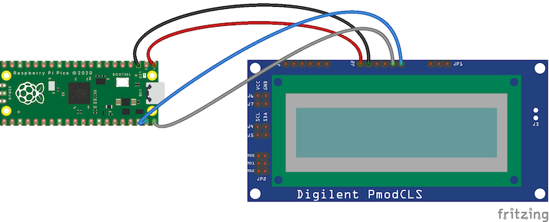
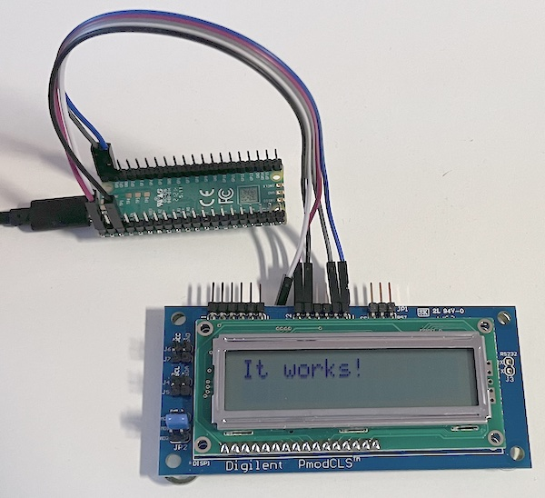

# pyPmodCLS (a Micropython library for Digilent PmodCLS LCD display)

This library allows to use the Digilent PmodCLS LCD display with MicroPython. It has been tested with a Raspberry Pi Pico, but should work with other devices running MicroPython

## Digilent PmodCLS LCD display


This display is a simple 16x2 character LCD module sold by Digilent. It can be driven by SPI, UART and I2C.
The library only proposes I2C connection

## Wiring (example with a Raspberry Pi Pico)
With the J2 connector, connect the LCD to the Raspberry Pi Pico following the schematic

- Pico Pin 40 (VBus) to J2, Pin 6 (VCC)
- Pico Pin 38 (GND) to J2, Pin 5 (GND)
- Pico GP0 (I2C0 SDA) to J2, Pin 2 (SDA)
- Pico GP1 (I2C SCL) to J2, Pin 1 (SCL)

And that's it !

## Code

First, upload the `pyPmodCLS.py` file on the device.

To use the library, it should be first imported
```
from pyPmodCLS import LCD
```

Then, an LCD object must be created, specifying the SCL and SDA pin (in that example 0 and 1)
```
lcd = LCD(SCL=1, SDA=0)
```

Once, done, the `lcd` object can be used to print characters
```
lcd.print("It works !")
```



## Methods
The library has the following methods:
- `print(string)`: it prints a string (from the current cursor position)
	- `string`: (str) string to be displayed
	- example: ```lcd.print("LCD rules!")```
- `clear()`:  clear the display
	- example: ```lcd.clear()```
- `turnOnOff(set)`: turn on or off (according to `set`) the display
	- `set`: (bool) set the display on (True) or off (False)
	- example: ```lcd.turnOnOff(False)``` turns off the display
- `cursorMode(cursor,blink)`: turns the cursor and the blinking option on or off
	- `cursor`: (bool) set the cursor on (True) or off (False)
	- `blink`: (bool) set the blink option on (True) or off (False)
	- example: ```lcd.cursorMode(True,False)``` display the cursor, but it doesn't blink
- `setCursorPosition(row, col)`: Set the cursor position to <row>,<col>
	- `row`: (int) row number (0 or 1)
	- `col`: (int) col number (0 to 39)
	- example: ```lcd.setCursorPosition(1,4)``` sets the cursor on the 2nd line (row=1) and 5th column
- `saveCursorPosition()`: save the cursor position
- `restorCursorPosition()`: restore the cursor position
		previously saved with `saveCursorPosition`


THe other methods are detailed in the comments of the file `pyPmodCLS.py`
